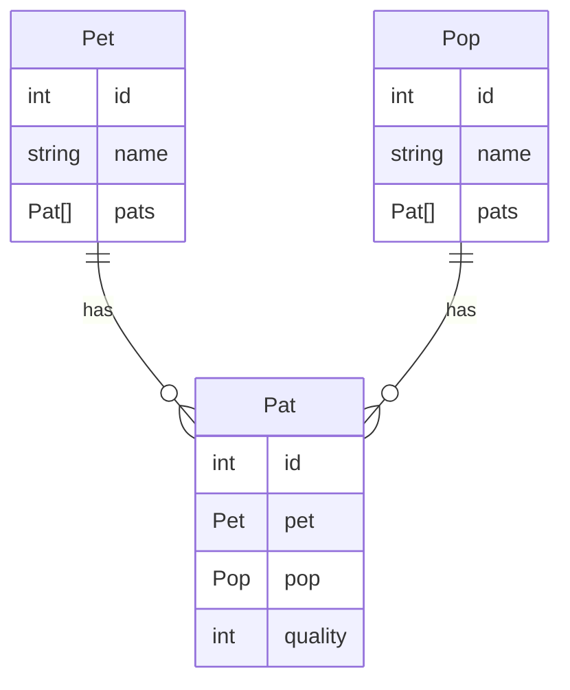

# API Documentation

This service exposes example data over a set of simple demonstration APIs. The intended purpose is as an
example service for various API client strategies.

# Data Structures

We'll expose a simple data structure, like this:

```python
@dataclass
class Pet:
    """Pets which are Patted by Pops"""

    id: int
    name: str
    pats: list[Pat]


@dataclass
class Pop:
    """Pops who Pat Pets"""

    id: int
    name: str
    pats: list[Pat]


@dataclass
class Pat:
    """Pats patted to Pets by Pops"""

    id: int
    pet: Pet
    pop: Pop
    quality: int
```



# APIs

The provided protocols and endpoints are:

<!-- ## GraphQL

TODO -->

<!-- ## gRPC

TODO -->

<!-- ## JSON-RPC

TODO -->

## RESTful

[Endpoint documentation available here](/docs#/RESTful).

<!-- ## SOAP

TODO -->

## Websockets

The Websocket endpoints don't show up in the Swagger docs, but its endpoint is exposed here:

ws://localhost:8008/websocket/ws

<!-- ## XML-RPC

TODO -->
